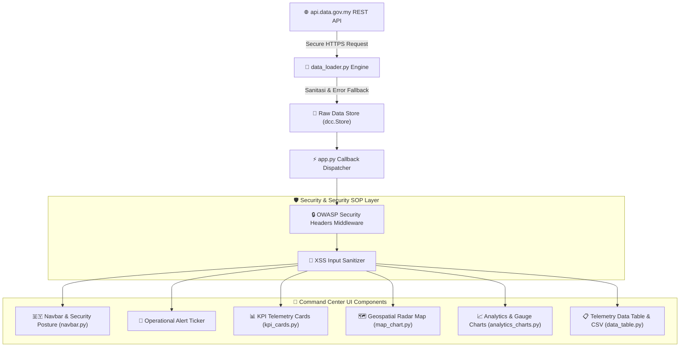

# 📐 System Design Document (SDD)
## Pusat Kawalan Bencana Negara (NDCC) | Malaysia Flood Warning & Telemetry System

---

## 1. 📌 Pengenalan & Scope System

Dokumen Rekabentuk Sistem (**System Design Document - SDD**) ini menerangkan seni bina perisian, aliran data, postur keselamatan (*Security SOP*), reka bentuk UI/UX, dan pipeline **CI/CD** bagi sistem **Pusat Kawalan Bencana Negara (NDCC) / Malaysia Flood Telemetry Dashboard**.

Sistem ini dibina untuk memantau 1,276+ stesen telemetri aras air sungai dan intensiti hujan di seluruh Malaysia secara *real-time* berasaskan data terbuka daripada **Agensi Pengurusan Bencana Negara (NADMA)** & **Jabatan Pengairan dan Saliran (JPS)** melalui API `api.data.gov.my`.

---

## 2. 🏛️ High-Level System Architecture

Sistem menggunakan seni bina terasing (*decoupled visual component model*) berasaskan **Python Dash (Flask WSGI)** pada lapisan aplikasi backend dan **Plotly.js / Carto Darkmatter** pada lapisan visualisasi frontend.



---

## 3. 🛠️ Tech Stack & Software Architecture

| Lapisan (*Layer*) | Teknologi / Pustaka | Fungsi |
| :--- | :--- | :--- |
| **Core Framework** | `Python 3.11`, `Dash 2.14` | Framework web react-python untuk aplikasi telemetry real-time |
| **WSGI Server** | `Flask`, `Gunicorn 21.2` | Pelayan pengeluaran HTTP bertaraf perusahaan (*production-ready*) |
| **Data Engine** | `Pandas 2.0`, `Requests 2.31` | Pemprosesan data telemetri, penapisan, dan integrasi REST API |
| **Visualisasi Peta** | `Plotly 5.18`, `Carto Darkmatter` | Peta geospatial interaktif berasaskan Mapbox GL JS |
| **Styling & UI System** | `Dash Bootstrap Components`, `CSS3` | Grid berasaskan Bootstrap, ikon `Bootstrap Icons`, dan tema NDCC |
| **Tipografi** | `Plus Jakarta Sans`, `Roboto Mono` | Fon rasmi identiti agensi kerajaan & bacaan telemetri berketepatan tinggi |
| **Testing** | `Pytest 7.4`, `requests-mock 1.12` | Ujian unit automatik dan persekitaran ujian terasing (*mocking*) |
| **Cloud Hosting** | `Render.com`, `Docker` | Deployment berasaskan fail manifest `render.yaml` & `Dockerfile` |

---

## 4. 🎨 UI/UX Design System & Theme Specification

Visualiti dashboard direka khas mengikut piawaian pusat kawalan bencana **Agensi Pengurusan Bencana Negara (NADMA)**:

- **Identiti Kebangsaan**: Lencana **Jalur Gemilang** rasmi (vektor SVG) dan lencana status klasifikasi maklumat (`SULIT RASMI`, `REST API data.gov.my`).
- **Kepadatan Data (Density Dial)**: High Density (`8/10`) — Menyajikan maklumat maksimum dalam ruang skrin minimum tanpa sesak.
- **Tipografi**:
  - `Plus Jakarta Sans`: Tajuk utama, label kawalan, dan teks antara muka.
  - `Roboto Mono`: Angka telemetri, kod stesen, paras air, dan cap masa (*tabular numbers*).
- **Token Warna NDCC**:
  - `Background`: Deep Government Slate (`#090e1a` / `#0f172a`)
  - `Surface Cards`: Slate Card (`#131d33`) dengan sempadan halus (`#1e2d4a`)
  - `NADMA Blue`: `#0284c7` (Identiti agensi & aksen carian)
  - `Danger Red`: `#ef4444` (Paras Bahaya & Evakuasi)
  - `Warning Amber`: `#f97316` (Paras Amaran & Siap Saga)
  - `Alert Yellow`: `#eab308` (Paras Waspada)
  - `Normal Green`: `#10b981` (Paras Selamat)

---

## 5. 🛡️ Security SOP Posture & Risk Defenses

Sistem ini melaksanakan standard keselamatan web **OWASP** menerusi `@server.after_request` di `app.py`:

```python
@server.after_request
def apply_security_sop_headers(response):
    csp_policy = (
        "default-src 'self'; "
        "script-src 'self' 'unsafe-inline' 'unsafe-eval' blob: https://cdn.jsdelivr.net; "
        "worker-src 'self' blob:; "
        "child-src 'self' blob:; "
        "style-src 'self' 'unsafe-inline' https://fonts.googleapis.com https://cdn.jsdelivr.net; "
        "font-src 'self' https://fonts.gstatic.com https://cdn.jsdelivr.net data:; "
        "img-src 'self' data: blob: https: http:; "
        "connect-src 'self' https: http:; "
        "frame-ancestors 'none'; "
        "base-uri 'self'; "
        "form-action 'self';"
    )
    response.headers['Content-Security-Policy'] = csp_policy
    response.headers['X-Frame-Options'] = 'DENY'
    response.headers['X-Content-Type-Options'] = 'nosniff'
    response.headers['X-XSS-Protection'] = '1; mode=block'
    response.headers['Strict-Transport-Security'] = 'max-age=31536000; includeSubDomains; preload'
    response.headers['Referrer-Policy'] = 'strict-origin-when-cross-origin'
    response.headers['Permissions-Policy'] = 'geolocation=(), microphone=(), camera=(), payment=(), usb=()'
    response.headers['Server'] = 'MY-NDCC-Secure-Gateway/2.0'
    return response
```

### Pertahanan Tambahan:
1. **Sokongan Mapbox Web Worker (`worker-src 'self' blob:;`)**: Membenarkan Mapbox GL JS menjana *web worker* berasaskan `blob:` untuk pemprosesan ubin peta tanpa menjejaskan CSP.
2. **Sanitasi Input XSS (`sanitize_security_input`)**: Semua teks carian dan penapis dibersihkan daripada tag `<script>`, `<iframe>`, dan pengendali acara (`onload=`).
3. **Resiliensi Rate-Limit (HTTP 429 Fallback)**: Apabila API luaran mengalami had kuota permintaan, `data_loader.py` mengembalikan struktur *DataFrame* bersiri penuh bagi memastikan UI tidak terhempas (*zero crash guarantee*).

---

## 6. 🔄 CI/CD Pipeline Architecture (GitHub Actions & Render)

Pipeline **CI/CD** diuruskan secara automatik menerusi fail `.github/workflows/ci-cd.yml`.

```mermaid
sequenceDiagram
    autonumber
    actor Developer
    participant GitHub as 🐙 GitHub Repo
    participant Actions as 🧪 GitHub Actions (CI)
    participant Render as 🚀 Render.com (CD)

    Developer->>GitHub: git push origin main
    GitHub->>Actions: Trigger Workflow (.github/workflows/ci-cd.yml)
    
    rect rgb(20, 30, 50)
        Note over Actions: JOB 1: Build & Test (CI)
        Actions->>Actions: 🐍 Setup Python 3.11 & Cache Pip
        Actions->>Actions: 📦 Install flake8, pytest, requests-mock, requirements.txt
        Actions->>Actions: 🔍 Flake8 Syntax Check
        Actions->>Actions: 🧪 Pytest Unit Tests (5/5 Passed)
    end

    alt Ujian Lulus (CI Success)
        rect rgb(10, 40, 30)
            Note over Actions, Render: JOB 2: Deployment (CD)
            Actions->>Render: POST RENDER_DEPLOY_HOOK_URL Webhook
            Render->>Render: 📦 Pull latest code & build image via render.yaml
            Render-->>Developer: 🌐 App Live at https://flood-warning-nadma.onrender.com
        end
    else Ujian Gagal (CI Failed)
        Actions-->>Developer: ❌ Block Deployment & Notify Failures
    end
```



---

## 7. 🧪 Unit Test Suite Structure

Ujian unit automatik dilaksanakan melalui `pytest tests/`:

- `test_get_status_color`: Menguji ketepatan kod warna indikator paras air (Danger/Warning/Alert/Normal).
- `test_sanitize_security_input`: Menguji keupayaan pembersihan payload berbahaya (XSS & Script Injection).
- `test_security_headers_middleware`: Menguji kehadiran kesemua 8 security headers OWASP pada respon HTTP server.
- `test_fetch_flood_warning_data`: Menguji integrasi API menggunakan `requests_mock` untuk kelancaran CI/CD.
- `test_components_layout_rendering`: Menguji integriti penyajian komponen UI (peta, tolok, jadual, KPI).

---

## 📄 Dokumen Rujukan Terkait
- [**`README.md`**](file:///Users/msharil/Devapp/antigravity/flood-warning/README.md) — Dokumen utama projek.
- [**`docs/RENDER_DEPLOYMENT.md`**](file:///Users/msharil/Devapp/antigravity/flood-warning/docs/RENDER_DEPLOYMENT.md) — Panduan penyebaran Render.
- [**`render.yaml`**](file:///Users/msharil/Devapp/antigravity/flood-warning/render.yaml) — Manifest deployment.
